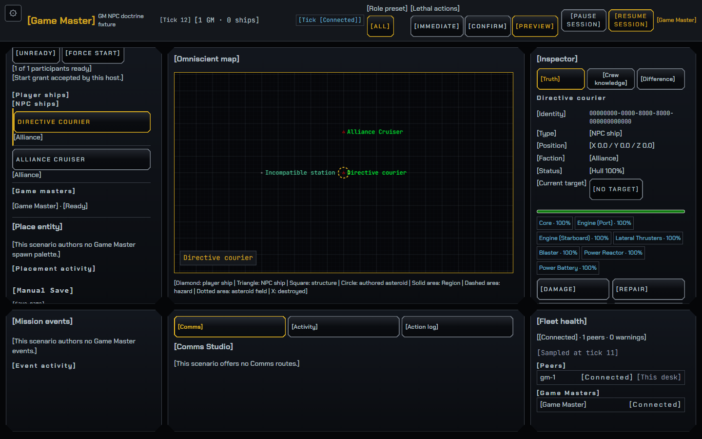
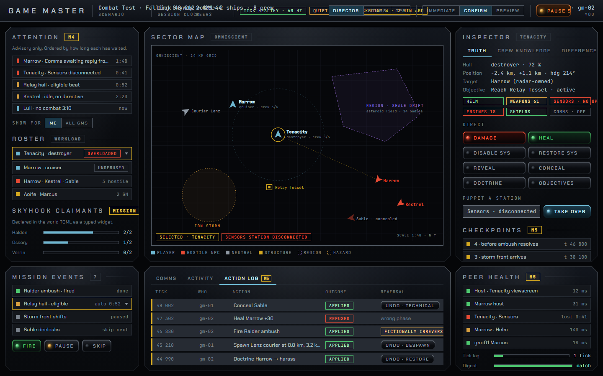

# GM desktop screen — review evidence

Branch: `codex/gm-screen`, based on local main `ec2d7fd0`.

The shared browser/native workspace now uses a Station Bar and a six-panel
layout: Roster, Sector map, Inspector, Mission events, Comms Studio and Activity.
Existing action forms remain reachable inside their panels. The knowledge observer selector remains independent of the map/action target. The authentic
Station console is below the workspace at 1280×720. No Rust, admission, action,
projection or wire contracts changed.

## Visual review

The left image is the real browser GM page; the right image is the supplied
“After M3 · MVP complete” artboard. The live screenshot uses the existing
`gm_npc_doctrine.toml` smoke world, so its ships and available controls differ
from the illustrative artboard. No fixture data is injected into the presenters.

- [1440×900 live page](gm-screen-1440.png)
- [1280×720 live page](gm-screen-1280.png)

The current payloads determine which fields can appear. Presets come from the
scenario, rather than inventing Director/Comms/Ops for worlds that author none.
The browser clock shows the exported authoritative tick; there is no shared
elapsed-time/rate projection from which to produce an honest mm:ss readout.
Native metadata has no clock or scenario-title fields. GM roster metadata has
no remote preset field. The entity projection has hull/System condition, but
no shield meter or universal concealed state (overrides are per observer).
Comms routes and hails are scenario-authored; no quick-template or attribution
controls were fabricated. Station pills show live Human/AI/Offline or mixed System control, with the delivered Station Rating as their fallback.

## Validation

The worktree preview was assembled from local main's existing built WASM and
this worktree's host HTML, JavaScript, CSS and strings. Rust is unchanged; this
was not a fresh Rust/WASM compilation.

- Targeted GM/native-GM and design-token Vitest suites: 704 tests passed.
- `node scripts/check-strings.mjs --strict`: zero errors or warnings.
- `cargo fmt -- --check`: passed.
- Native engine: existing `native_gm_ultralight-e291ad7ddeace1a5.exe`, run from
  this worktree against its updated `dist/`: one real Ultralight fixture passed.
- Browser standard gate: 26 passed; the explicitly gated M2 case was skipped.
- Explicit M2 (`PHOENIX_M2_EXIT=1`): passed, including matching native replay.
  The frozen replay executable's six ordinary fixture tests passed first.
- The final observer-selector layout was checked again at both viewport sizes;
  its screenshot test and the native engine fixture passed.
- Wiki index links and GM Operator source references resolve; `git diff --check`
  is clean.

Prebuilt artifacts used (SHA256):

- WASM `project-phoenix-af8652e2104844e9_bg.wasm`:
  `ABA4E0D4DC39D7BDED186AA68D959F7CC6E64CB76D2708C90CC8C9C1EDDE8771`
- Native replay `recorded_gm_exports-b17c52c35bcd11bf.exe`:
  `9F650B22BF4F164A766B59337FE95FFDCB905D84F5022D306C88C055FFF07A3A`

The new `gm-layout.spec.js` exercises roster selection and checks for workspace
horizontal overflow at both requested viewport sizes; screenshots are retained
as Playwright attachments. The existing GM action, confirmation, reconnect and
M1/M2 smoke suites retain their existing assertions.

## Post-M5 screen (2026-09-11)

The desk now draws the design canvas's second artboard, "After M5 · facilitation
+ operations" (canvas
`https://claude.ai/code/artifact/1ff3f563-54c4-4423-934d-2f20f9a86c26`, PRD
#930). Same posture as the After-M3 pass above: presentation only. No Rust, no
admission, action, projection or wire contract changed, and no fixture data is
injected into the presenters — the live payloads decide what can appear.

### What changed against the After-M3 screen

One bar and three columns, as before; the nine grid cells become **six regions**,
because the artboard's later panels arrive inside a frame that already exists
rather than in a cell of their own.

| Region | Holds | Was |
| --- | --- | --- |
| Row 1 left `#gm-desk-brief` | Attention (M4), Roster, Station workload, authored widgets (#1439) | four separate cells down the left column |
| Row 1 centre `#gm-map-panel` | omniscient map | unchanged (never reparented — that would cancel `<ph-navigation-map>`'s render loop) |
| Row 1 right `#gm-desk-detail` | Inspector, then Checkpoints + live restore | Checkpoints were a section inside the Inspector |
| Row 2 left `#gm-mission-panel` | Mission events | unchanged |
| Row 2 centre `#gm-desk-log` | tab strip Comms · Activity · Action log | Comms had the cell; Activity had another; the journal was in the Inspector |
| Row 2 right `#gm-health-panel` | Peer health (M5) | left column, row 3 |

The bar gains the artboard's health pills, and each roster row gains the
workload word #1438 already publishes for its Stations.

### Real page beside the artboard

| Live page | Artboard |
| --- | --- |
|  |  |

- [1280×720 live page](gm-screen-m5-1280.png)
- [1280×720 at `--a11y-text-scale: 2`](gm-screen-m5-1280-200pc.png)

All three are Playwright attachments from
`tests/smoke/gm-layout.spec.js › GM desktop layout is usable at both host
viewport sizes`, driven by the shipped `gm_npc_doctrine.toml` smoke world. Its
one NPC hull and absent Comms routes are why the live page is emptier than the
illustrative artboard.

### What the payloads can and cannot show

- **Health pills.** Three, and only when a live payload carries them. The tick
  pill needs a `gm_health` payload that actually says something (a peer, a
  Station, an operator, an alert or a deliberate pause); the quiet pill is the
  `gm_attention` quiet-time occurrence's own age; the checkpoint pill is the
  highest capture tick in this browser's own catalogue.
- **The quiet pill counts with the row, not with the payload.** `src/gm_attention.rs`
  deliberately does not republish on age alone, and `src/gm_quiet.rs` keeps one
  id and one authored `seconds` for a whole lull, so the last payload of a lull
  is the only one the page sees. The queue panel — the one surface that knows
  when this browser first saw a row — therefore ages its own rows, reports that
  live age through `state()`, and repaints the bar on its own one-second tick
  (`onAge` → `shell.refresh()`). A pill fed the raw `age_ms` froze at the sample
  while the row beneath it counted on.
- **No "60 Hz" and no "2 min ago".** The artboard's tick rate and wall-clock
  checkpoint age have no projection behind them. A rate is not published, and
  the desk has no shared elapsed-time basis to age a checkpoint against (the
  same gap the After-M3 note records for the session clock). Both are stated in
  the units that do exist: a health WORD, and the capture tick.
- **Roster workload.** The worst level the advisory published for that hull's
  Stations, as a word. A hull whose Stations are all Backfill (or all Offline)
  says that instead; a hull the advisory published nothing for says nothing.
  The artboard's "3 hostile" / "2 GM" group rows are the existing NPC and Game
  Master groups, unchanged.
- **Authored mission panel.** Whatever the loaded world's role preset composes
  through #1439's four typed widgets. The artboard's "Skyhook claimants" meters
  are illustrative; the smoke world authors none, so the section is absent —
  which is what the region's `hidden` state is for.
- **Peer health** keeps #1437's own wording and its unfilterable banner region,
  which stays beside the attention queue rather than moving into this panel.
- **Checkpoints and restore** keep #1445/#1446's own String Table rows,
  including the paused-transfer wording on Restore. Nothing about the control
  changed; only where the section sits.
- **Native.** The native GM monitor loads this same markup, CSS and shell, so it
  gets the same six regions. It still has no clock or scenario-title field, and
  those degrade rather than being fabricated — unchanged from the After-M3 note.

### Three decisions worth reading

- **The tab strip never writes `hidden`.** `hidden` on `#gm-comms-panel` and
  `#gm-activity` belongs to the role preset (`GM_ROLE_PRESET_PANEL_IDS`), so the
  view is switched with `data-log-view` on the region and a preset that hides a
  panel hides its TAB instead. The shell also exposes `showLog(panelId)`, which
  the attention queue's "open this Comms route" navigation calls before focusing
  the route: a `display: none` panel has nothing to focus.
- **One scroll box per region.** The sections inside a region do not open their
  own. Four nested scroll boxes between a bounded list and the page let a row be
  scrolled into view at every level and still not be where a click lands;
  `tests/smoke/gm-checkpoint-200.spec.js` caught exactly that at 200% text, as a
  checkpoint row whose own sibling summary line intercepted every click. The
  chain is now the same depth the After-M3 desk had.
- **The roster's repaint guard holds the derived WORD, not the advisory.** A
  `gm_workload` row carries `sustained_secs`, which moves about once a simulated
  second while any Station holds demand, so hashing the projection itself would
  rebuild every roster button a second — eating a mousedown held on a row and
  losing a screen reader's place in the ship list — for a word that had not
  changed. The signature carries `workloadWord(entity_id)` per hull instead.

### Validation

Rust is unchanged. The bundle under test was a full `trunk build` plus
`node scripts/build-client.mjs` in this worktree, so the page, the shell, the
sheet and the string table are all this branch's.

- `node scripts/check-strings.mjs --strict`: 3298 strings, 0 errors, 0 warnings.
- `npx vitest run tests/client/gm-*.test.js`: 33 files, 627 tests passed.
- `npx vitest run tests/client/accessibility-200-percent.test.js
  tests/client/accessibility-presentation.test.js
  tests/client/native-gm-workspace.test.js tests/client/native-gm-bridge.test.js
  tests/client/design-tokens.test.js tests/client/console-tokens.test.js`:
  632 passed.
- Playwright (chromium, `PHOENIX_SMOKE_PORT=3131`):
  `gm-layout.spec.js` desktop-layout and dense-directing cases, plus
  `gm-checkpoint-200`, `gm-journal-200`, `gm-undo-200`, `gm-confirmation`,
  the `gm-m1-exit` retained-peer-trace case and the six `gm-page.spec.js` cases
  that read Comms or the activity feed — all pass.

The two review findings above (the frozen quiet pill, the roster rebuilt by the
workload advisory's tick) were fixed with tests that fail without the fix:
`tests/client/gm-attention-panel.test.js › keeps ageing the lull row when
nothing republishes, and says so`, `tests/client/gm-workspace-shell.test.js ›
repaints the roster on a changed workload word, not on the advisory ticking`,
and the quiet-pill case in `gm-layout.spec.js`, which now reads the pill and the
lull row as one live clock and polls the pill forward with no further payload.
That spec was re-run in a real engine after the fix
(`PHOENIX_SMOKE_PORT=3137 npx playwright test gm-layout.spec.js
--project=chromium`, from `tests/smoke/`): 2 passed, 4 failed — the same four
pre-existing failures listed below.

Four cases in `gm-layout.spec.js` (Station puppet, browser zoom, forced colours,
performing panels), `gm-restore-200.spec.js` and `gm-page.spec.js`'s spatial
Helm case fail on this integration branch BEFORE this change as well; each was
re-run against the branch's own `gui/` to confirm that, and none of them is
about this layout.
