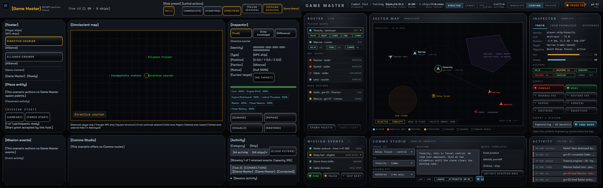

# GM desktop screen — review evidence

Branch: `codex/gm-screen`, based on local main `ec2d7fd0`.

The shared browser/native workspace now uses a Station Bar and a six-panel
layout: Roster, Sector map, Inspector, Mission events, Comms Studio and Activity.
Existing action forms remain reachable inside their panels. The knowledge observer selector remains independent of the map/action target. The authentic
Station console is below the workspace at 1280×720. No Rust, admission, action,
projection or wire contracts changed.

## Visual review

The left image is the real browser GM page; the right image is the supplied
“After M3 · MVP complete” artboard. The live screenshot uses the existing
`gm_npc_doctrine.toml` smoke world, so its ships and available controls differ
from the illustrative artboard. No fixture data is injected into the presenters.

- [1440×900 live page](gm-screen-1440.png)
- [1280×720 live page](gm-screen-1280.png)

The current payloads determine which fields can appear. Presets come from the
scenario, rather than inventing Director/Comms/Ops for worlds that author none.
The browser clock shows the exported authoritative tick; there is no shared
elapsed-time/rate projection from which to produce an honest mm:ss readout.
Native metadata has no clock or scenario-title fields. GM roster metadata has
no remote preset field. The entity projection has hull/System condition, but
no shield meter or universal concealed state (overrides are per observer).
Comms routes and hails are scenario-authored; no quick-template or attribution
controls were fabricated. Station pills show live Human/AI/Offline or mixed System control, with the delivered Station Rating as their fallback.

## Validation

The worktree preview was assembled from local main's existing built WASM and
this worktree's host HTML, JavaScript, CSS and strings. Rust is unchanged; this
was not a fresh Rust/WASM compilation.

- Targeted GM/native-GM and design-token Vitest suites: 704 tests passed.
- `node scripts/check-strings.mjs --strict`: zero errors or warnings.
- `cargo fmt -- --check`: passed.
- Native engine: existing `native_gm_ultralight-e291ad7ddeace1a5.exe`, run from
  this worktree against its updated `dist/`: one real Ultralight fixture passed.
- Browser standard gate: 26 passed; the explicitly gated M2 case was skipped.
- Explicit M2 (`PHOENIX_M2_EXIT=1`): passed, including matching native replay.
  The frozen replay executable's six ordinary fixture tests passed first.
- The final observer-selector layout was checked again at both viewport sizes;
  its screenshot test and the native engine fixture passed.
- Wiki index links and GM Operator source references resolve; `git diff --check`
  is clean.

Prebuilt artifacts used (SHA256):

- WASM `project-phoenix-af8652e2104844e9_bg.wasm`:
  `ABA4E0D4DC39D7BDED186AA68D959F7CC6E64CB76D2708C90CC8C9C1EDDE8771`
- Native replay `recorded_gm_exports-b17c52c35bcd11bf.exe`:
  `9F650B22BF4F164A766B59337FE95FFDCB905D84F5022D306C88C055FFF07A3A`

The new `gm-layout.spec.js` exercises roster selection and checks for workspace
horizontal overflow at both requested viewport sizes; screenshots are retained
as Playwright attachments. The existing GM action, confirmation, reconnect and
M1/M2 smoke suites retain their existing assertions.
