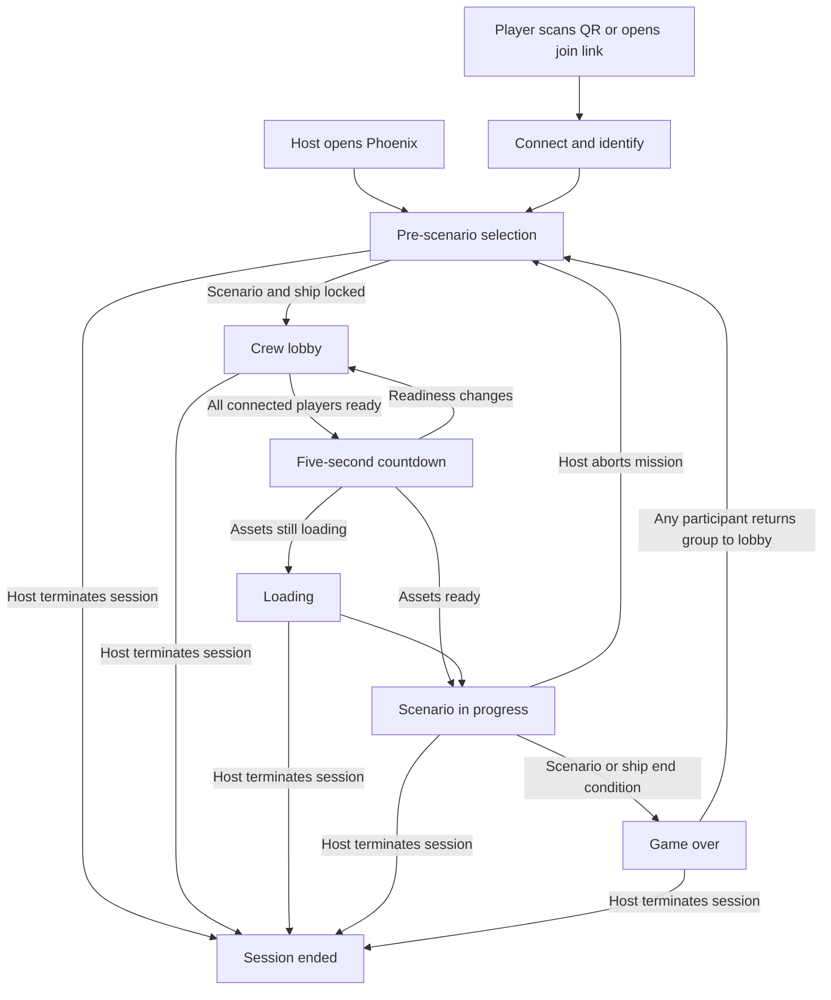

# Project Phoenix — Game and Session Lifecycle

| Field | Value |
|---|---|
| Document | GDD-LIFECYCLE |
| Status | Working draft |
| Owner | Unassigned |
| Last updated | 2026-08-19 |
| Scope | Enter game, connection lifecycle, lobby, scenario entry, scenario end, replay, and exit |
| Authority | Design overview. Code and assets are runtime truth; PASM is design and architecture truth. |

This document defines the player-facing lifecycle around a Phoenix scenario. It covers how a group forms, how a player's identity survives connection changes, how the crew enters and leaves a scenario, and what the game must preserve or discard at each boundary. Detailed network protocols, station mechanics, and scenario rules belong in their own specifications.

Related documents: [Game Design Overview](./overview.md), [Campaign Continuity and Persistence](./campaign-continuity.md), [Onboarding and Accessibility](./onboarding-accessibility.md), [Station Experiences](../systems/station-experiences.md), [AI and Backfill](../systems/ai-and-backfill.md), [Native and Network Foundation](../systems/native-network-foundation.md), and [Future Modes](../future/future-modes.md).

## Lifecycle goals

- A new group can reach play through the zero-setup browser route without accounts, installation, or LAN configuration.
- A transient phone or network failure does not silently turn into a new player identity or permanently disable a station.
- The whole crew can see which scenario, ship, players, stations, ratings, and ready states are active before play begins.
- Scenario entry is collective and legible: readiness produces a visible countdown, loading is explicit, and play begins from one authoritative transition.
- Players may join, leave, reconnect, or hand stations to Backfill AI without restarting the scenario.
- A scenario ends for the whole session, with a readable outcome and a deliberate transition into replay, another scenario, or exit.
- Closing a phone, leaving a station, returning to the lobby, and terminating the host have distinct meanings.

## Lifecycle model

The pre-scenario selector is currently hosted by the page before the Bevy simulation is fully running. From a player perspective it is part of the same lobby journey, but it is distinct from the runtime `GamePhase::Lobby` state.

Connection loss is a per-player condition layered over these shared states. It does not create a separate global phase.

## Shared states

| State | Player experience | Entry condition | Exit condition |
|---|---|---|---|
| Host startup | The host loads the game, starts the authoritative session, obtains a join address, and builds the available scenario catalogue. | Host opens the browser or native host. | Catalogue and join route are ready, or startup fails with a recoverable error. |
| Pre-scenario selection | Connected participants can see and select the next scenario and playable ship. | New session or return from a completed/aborted round. | One valid scenario and one valid ship are locked. |
| Crew lobby | Players edit names, claim stations, choose station ratings, read help, and ready up. | Scenario and ship are locked and their lobby data is available. | All connected players remain ready through the countdown. |
| Loading | The group waits while remaining render assets become ready. Progress is visible; reconnect remains available. | Countdown completes before asset preload does. | Required assets are ready. |
| In progress | The authoritative simulation runs and station commands affect the shared world. | Countdown completes with assets ready, or Loading completes. | A scenario/ship end condition or host abort. |
| Game over | The scenario is stopped and its outcome, reason, and scenario identity are presented. | Authored `game_over`, player-ship destruction, or another authoritative terminal condition. | Return to lobby or host termination. |
| Session ended | No authoritative host remains. Clients cannot continue issuing meaningful commands. | Explicit host shutdown, host page closure, host crash, or unrecoverable host loss. | A new host session and join route are created. |

## 1. Enter game

### Host entry

The host opens Phoenix on a shared display or native host. The host becomes the authoritative simulation owner, publishes the join route as a QR code/link, loads the scenario catalogue, and exposes pre-scenario selection. The QR code should be available before scenario selection finishes so players can join while the host is choosing.

Startup failures should name the failed stage and offer a useful recovery action. Catalogue failure, content incompatibility, renderer failure, signalling failure, and missing relay capability are different problems and should not collapse into a generic loading screen.

### Human-readable join codes

Band A2 replaces raw PeerJS routing identifiers with typed human-readable codes. Client and server joining use separate project GUIDs, a shared compatible-release version GUID and separate five-letter suffixes. Ordinary players enter only the suffix or scan a QR code; the full `PROJECT_GUID_VERSION_GUID_CODE` form supports copying and diagnostics. Each ship host issues a private client code which no other host or simulation state sees. One privileged server code admits and recovers hosts in a multi-ship session.

The rendezvous layer distinguishes unknown, wrong-type and version-mismatched codes before transport setup. The eventual host handshake still refuses incompatible protocol/content stamps authoritatively. Codes survive reconnects and mission transitions. Rotation is explicit and restricted to periods when no mission is running.

### Player entry

A player scans the QR code or opens the join link. The client creates or recovers a session token and a display name, connects to the host, and sends an identification handshake. The host replies with a complete `Welcome` projection containing the current phase, player roster, selected ship's stations, ratings, and any live scenario state needed to reconstruct the console.

No external account is required for baseline play. The session token identifies the player to this host; the transient WebRTC peer ID only routes the current connection.

### Multi-ship host entry and replacement

Before mission start, an open server code admits new ship hosts. Mission start freezes player-ship slots and their loadouts. Closing host admission blocks new slots but the same server code remains a recovery capability: a replacement machine can claim any currently disconnected fixed slot, never a connected one. While a ship host is absent, the remaining hosts apply an agreed tick-stamped transition and operate that ship through ordinary Backfill. A successful replacement restores the shared snapshot/history and rebinds the ship's existing client code so its players reconnect without receiving a new route.

### Joining before scenario selection

Players may connect while the scenario picker is still open. Host and phones see the same catalogue and current lock state. Any participant may make the first valid scenario selection, followed by the first valid ship selection. This is first-valid-wins, not a vote and not captain authority. A scenario with exactly one offered ship selects it automatically.

### Joining after scenario start

A late joiner receives the current phase and a reconstruction of authoritative state. They enter without a station, may claim any station not held by a connected player, and see enough lobby/help information to understand it before taking control. Claiming during a scenario reserves the station but leaves Backfill AI operating until the player explicitly chooses **Take Station**.

## 2. Connecting and reconnecting

### Identity, presence, and station ownership

Phoenix treats three facts separately:

| Fact | Meaning | Lifetime |
|---|---|---|
| Session identity | The player's token and display name. | Retained by the host across disconnect/reconnect and by the client across ordinary refresh. |
| Presence | Whether a live transport connection currently exists. | Changes whenever the link opens or closes. |
| Station ownership | The station the player most recently claimed. | Retained on the disconnected player record for reconnect-yield, but does not block another connected player from claiming the station. |

Duplicating a browser tab must not collapse two active people into one identity. The browser client therefore keeps an active per-tab identity while using local persistence to recover ordinary refreshes.

### Connection feedback

The client should always expose whether it is connecting, connected, reconnecting, or unable to recover. A reconnecting player keeps their current console visible but clearly non-live; stale controls must not appear to have been accepted. The player can request an immediate retry rather than waiting for automatic backoff.

When relay service is unavailable or degraded, the host and joining player should see that diagnostic before blaming the scenario or device. Network diagnostics are player support, not game state.

### Transient disconnect

When a player disconnects:

1. Their presence becomes disconnected and their ready state clears.
2. Their previous station and rating are remembered for reconnect-yield.
3. The station immediately changes to Backfill so the ship continues operating.
4. The station becomes available for another connected player to claim.
5. The remaining crew sees that the player left and that the station is automated.
6. If the crew is in the lobby, collective readiness and the countdown are recalculated.

The last connected player leaving must never cause the scenario to auto-start with zero humans.

### Reconnect

Automatic reconnect retries persist with bounded backoff. When the same session token identifies again:

- If the previous station has not been claimed by another connected player, the station and saved human rating are restored.
- If another player has claimed it, the returning player rejoins without a station and may choose another available one.
- The client receives a fresh authoritative projection; it does not rely on locally cached simulation state.
- In Loading or InProgress, reconnect does not restart or rewind the scenario.

The target lifecycle also permits reconnect during GameOver so a refreshed player can see the terminal result and participate in the return. The current runtime processes `Identify` during Lobby, Loading, and InProgress but not GameOver; this is an implementation gap rather than a desired loss of identity at the final screen.

### Host disconnect

In the current single-host model, losing the host is different from losing a phone: the authoritative simulation has gone. Clients may report and retry the link, but they cannot elect a replacement or continue locally. Refreshing the host may also create a new join route that existing clients do not know. Host migration and recovery belong to the accepted future P2P multi-ship design, not the current baseline promise.

## 3. Pre-scenario selection and lobby

### Scenario and ship selection

The selectable catalogue comes from the host's active manifest and content overlays. The selected scenario determines its offered player ships; an optional curated manifest may narrow both the scenario list and the allowed hulls without changing the scenario file itself.

Selection rules:

- Any connected participant or the host may submit a selection.
- The first valid request at each stage locks that choice.
- Later or invalid requests do not replace a locked choice.
- Scenario selection precedes ship selection.
- A single offered hull auto-selects.
- The lock state is shared so all clients can see what won.
- Changing a locked choice requires returning to the pre-scenario selector; it is not an ordinary lobby toggle.

### Crew lobby

After the scenario and ship are locked, every connected player sees the same roster. Players may:

- edit their display name;
- inspect the selected scenario and ship;
- claim or change to an available station;
- release a station;
- choose an authored station rating;
- read station help and the ship manual;
- mark themselves ready or not ready.

A station can be held by at most one connected player. New players are never auto-assigned. Moving to another station releases the old one. Unfilled stations do not block scenario start because Backfill AI operates them.

### Stationless participants

When all stations are held, another player currently joins without a station. Band A2 formalises this as a Spectator role with one crew-public summary screen. Spectators do not count toward readiness, cannot issue simulation commands and may manually claim an eligible open station.

Current readiness counts every connected session, including a stationless participant. Band A2 changes that contract so explicit spectators do not count toward collective readiness.

### Collective readiness

Normal scenario start is collective, not captain-only:

1. Every connected player sets ready.
2. A visible five-second countdown begins.
3. A player unreadying, a new unready player joining, or another change that makes `all_ready` false cancels the countdown.
4. A disconnect removes that person from the connected set and recalculates readiness; if everyone remaining is ready, the countdown may begin or continue from a fresh start.
5. On expiry, the host enters Loading if required assets remain, otherwise it enters InProgress.

The host has a development/facilitation force-start path, but it is not the ordinary crew rule and should not replace collective readiness in the player-facing design.

## 4. Enter scenario

Scenario entry is a boundary, not merely the lobby disappearing. Before the first simulation tick of a round, the host must have a locked scenario and ship, a valid world/configuration set, an authoritative station/control-source resolution, and a clean set of per-round runtime state.

### Loading presentation

If assets are still loading after the countdown, every client receives visible progress. Players may reconnect during Loading and recover their lobby identity and station. Simulation commands do not take effect as scenario play until InProgress.

### Start presentation

When entry completes:

- the shared viewscreen changes from lobby/loading presentation to the scenario view;
- each seated player reaches the console derived from their station;
- unfilled stations begin under Backfill control;
- pending lobby station ratings become active;
- scenario entities, objectives, clocks, and scripts begin from the same authoritative round boundary;
- all clients receive an explicit start signal rather than inferring start from the first snapshot.

### Mid-round joining and station hand-off

Joining remains open during InProgress. A player claiming a free station first sees it under Backfill and must use **Take Station** to accept human control. Releasing a station mid-round requires confirmation because it immediately transfers its systems back to Backfill. A participant may leave their own station; they may not return the entire crew to the lobby while the scenario is running.

## 5. Scenario end

### End conditions

A scenario ends only through an authoritative terminal condition. Typical causes include:

- an authored victory, defeat, or neutral end action;
- destruction of the player ship;
- failure or completion of a mission-critical objective;
- a host-authorised mid-mission abort.

The outcome classification and explanatory reason are separate. A scenario may end as victory or defeat with an authored reason, or may end without declaring either and be presented neutrally as **Ended**. The client must not invent an outcome from the wording of the reason.

### Game-over presentation

On entry to GameOver:

- scenario simulation input stops affecting play;
- all clients receive the same outcome and reason;
- the scenario title and terminal message remain visible;
- the console may remain visible behind the overlay for context but must read as inactive;
- every connected participant is offered **Return to Lobby**.

A richer debrief may later add objectives, casualties, promises, evidence, balance events, or campaign consequences. Those additions should extend the terminal record rather than delay the authoritative GameOver transition.

### Authority at scenario end

| Action | Lobby | Loading | InProgress | GameOver |
|---|---:|---:|---:|---:|
| Participant releases own station | Yes | Yes | Yes, with confirmation | Not a meaningful end action |
| Participant returns whole group to lobby | No | No | No | Yes |
| Host returns whole group to lobby | No-op | Not currently offered | Yes | Yes |
| Closing a participant client | Disconnects that participant | Disconnects that participant | Disconnects; Backfill takes station | Disconnects that participant |
| Closing the host | Ends authoritative session | Ends authoritative session | Ends authoritative session | Ends authoritative session |

Any participant may currently trigger the shared return after GameOver. This avoids making a disconnected host-side operator or absent captain the only route forward, but it also means one player can dismiss the result for everyone. A short acknowledgement period or host-only ceremony is an optional future presentation decision, not current behaviour.

## 6. Return to lobby and next round

Returning to the lobby is a group transition. It preserves player identity and live connections while clearing round-specific crew setup:

| Preserved | Cleared or reset |
|---|---|
| Connected transport where still live | Ready state |
| Session token | Station claims |
| Player display name | Pending lobby station ratings |
| Connection presence | Scenario and ship selection lock |
| Long-term/campaign data when explicitly part of a save | Per-round transient state |

The group returns to the scenario selector, not directly to the prior station roster. A new scenario and ship are selected through the same first-valid-wins flow as the first round, then the crew claims stations and readies again.

### Clean-round requirement

The intended rule is that a new round must not accidentally inherit transient state from the previous one: entities, damage, objectives, script flags, deadlines, comms, countdowns, control-source transitions, terminal reason, broadcast caches, or command log. Only state explicitly defined as session-level or campaign-level may cross the boundary.

The current implementation clears identity-adjacent lobby state and reopens selection, and it resets some per-run services when InProgress is entered again. However, the host page also reuses the already-loaded WASM/world instance after Return to Lobby. A complete world teardown/reload or authoritative round-reset contract is not yet captured in PASM, so selecting a different scenario or replaying the same one cleanly should be treated as an unresolved lifecycle requirement rather than a finished product promise.

## 7. Exit game

Phoenix needs clear language for several actions that are often all labelled “leave”:

### Leave Station

The player remains connected to the session but relinquishes their station. In the lobby this is immediate. During a scenario it requires confirmation and the station returns to Backfill.

### Disconnect or close client

The player leaves the live connection but retains reconnectable identity. During a scenario their station immediately runs on Backfill and becomes claimable by another connected player. Closing a phone is therefore recoverable absence, not a request to end the scenario.

### Leave Game

There is no explicit participant **Leave Game** operation in the current product; closing the client produces a disconnect and the host retains the session record indefinitely. A future explicit action should disconnect immediately, release any station to Backfill, remove the player from readiness, and return the client to a neutral join screen. Whether it also forgets the local identity/name should be a separate choice, not an automatic consequence.

### Exit to Lobby

This keeps the host and participant connections alive but ends the current round context. During InProgress only the host may abort the group to the lobby. During GameOver any connected participant may return the group.

### End Session / Exit Host

The host terminates the authoritative session. This affects every participant and should require confirmation when a round is active. Where possible, an explicit host exit should broadcast a terminal session-ended reason before shutdown so clients can stop retrying and offer a useful next action. Browser closure or host crash cannot guarantee that message; clients must also recognise prolonged or terminal host loss.

No current client-side action may shut down the host or end the session for everyone.

## Persistence boundaries

| Data | Reconnect | Return to lobby | New host session |
|---|---:|---:|---:|
| Player token and name | Preserve | Preserve | Client may reuse identity, but the new host creates a new session record |
| Live connection | Re-establish | Preserve if live | Re-establish against new join route |
| Station claim | Restore if still free | Clear | Clear |
| Station rating | Restore after transient disconnect if station is free | Clear pending/current round choice | Clear |
| Ready state | Clear on disconnect | Clear | Clear |
| Scenario state | Continues while host remains | Reset for new round | Absent unless explicitly restored from a compatible save |
| Campaign/save state | Unchanged | Preserve only through explicit campaign/save rules | Load only through explicit compatible restore |
| Uploaded mod-pack overlay | Unchanged during round | Current host flow clears it | Absent until uploaded again |

## Failure and edge-case rules

- A malformed or reserved identity must not gain host or AI authority.
- A duplicate active browser tab must not impersonate the already active player.
- A station claim rejected because another connected player holds it must leave both players' existing assignments unchanged.
- A disconnected player's retained historical station must not block a connected player from claiming it.
- Reconnect restoration must yield to the connected current holder.
- Joining during the countdown must make the new player's unreadiness visible and cancel start.
- Disconnecting the last player must not start an all-AI round through the collective-ready rule.
- Unfilled stations must not prevent start.
- A participant message must not abort an InProgress scenario for the whole crew.
- Returning after GameOver must clear every station and ready state for every known player, not only the requester.
- Host loss must never leave controls looking live against a simulation that no longer exists.
- Starting another round must not reuse terminal or transient state unless a campaign/save contract explicitly says to preserve it.

## Acceptance criteria

### Connection

- A first-time browser client joins through the QR route, identifies, and receives the current shared state without an account.
- Refreshing a client reconnects as the same player and restores an unclaimed station and rating.
- If the prior station was claimed during the absence, reconnect succeeds without taking it from the current holder.
- A connection loss visibly enters reconnecting state, automatically retries, and never accepts optimistic commands while non-live.
- Host loss produces a distinct client state from ordinary phone reconnect.

### Lobby and entry

- All connected clients show the same locked scenario, ship, roster, station claims, ratings, and ready states.
- First-valid-wins selection produces one scenario and ship even under simultaneous requests.
- One offered ship auto-selects; multiple offered ships require a choice.
- All connected players readying starts a visible five-second countdown.
- Unreadying or a new unready join cancels the countdown for everyone.
- Empty stations do not block start; zero connected players cannot start through readiness.
- Loading progress is visible when required and reaches a clear transition into InProgress.

### Active scenario

- A disconnect switches the player's station to Backfill without pausing the scenario.
- A late joiner can claim a free station, inspect it, and explicitly Take Station from Backfill.
- A mid-round station release requires confirmation and restores Backfill.
- A participant cannot return the group to the lobby from InProgress; the host can.

### End and exit

- Every client receives the same terminal outcome and reason.
- Any participant can return the group from GameOver; all clients transition together.
- Return clears station claims, ready states, and pending ratings while preserving connected identities and names.
- A new round begins from a verified clean scenario-state boundary.
- Explicit host exit warns during active play and, when transport permits, tells clients the session ended.

## Open lifecycle decisions

- Define and implement the clean round-reset/world-reload contract, including selecting a different scenario after GameOver.
- Admit reconnect and terminal-state reconstruction during GameOver.
- Implement Band A2's spectator role, readiness exclusion, summary surface and manual claim flow.
- Decide whether GameOver needs a minimum acknowledgement period before any participant can dismiss it for everyone.
- Define an explicit participant Leave Game action and whether disconnected session records expire.
- Define explicit host End Session presentation and the client experience after intentional shutdown versus host failure.
- Decide whether Loading may be cancelled or returned to selection after a content/preload failure.
- Implement the campaign creation, checkpoint, branch, and episode-selection flow defined in [Campaign Continuity and Persistence](./campaign-continuity.md), then integrate it with the default preservation table.
- Revisit host-loss recovery when P2P multi-ship leadership and snapshot recovery ship.

## Canonical sources

- [Game flow design](../../../pasm/spec/design/game-flow.yaml) — player verbs and round-return intent
- [Sessions and replication](../../../pasm/spec/architecture/sessions-replication.yaml) — identity, station ownership, transport, and replicas
- [P2P design deltas](../../../pasm/spec/design/p2p-design-deltas.yaml) — future host mesh and recovery constraints
- [Game phases](../../../wiki/concepts/game-phases.md) — current phase-oriented code map
- [Networking](../../../wiki/concepts/networking.md) — current browser connection lifecycle
- [Player](../../../wiki/entities/player.md) and [Session](../../../wiki/entities/session.md) — current identity and reconnect model
- [Lobby handler](../../../src/lobby/handler.rs), [session manager](../../../src/lobby/session.rs), and [lobby runtime](../../../src/lobby/server.rs) — runtime truth
- [Host page](../../../server.html) and [phone client](../../../client.html) — pre-scenario selection, connection presentation, and exit surfaces
